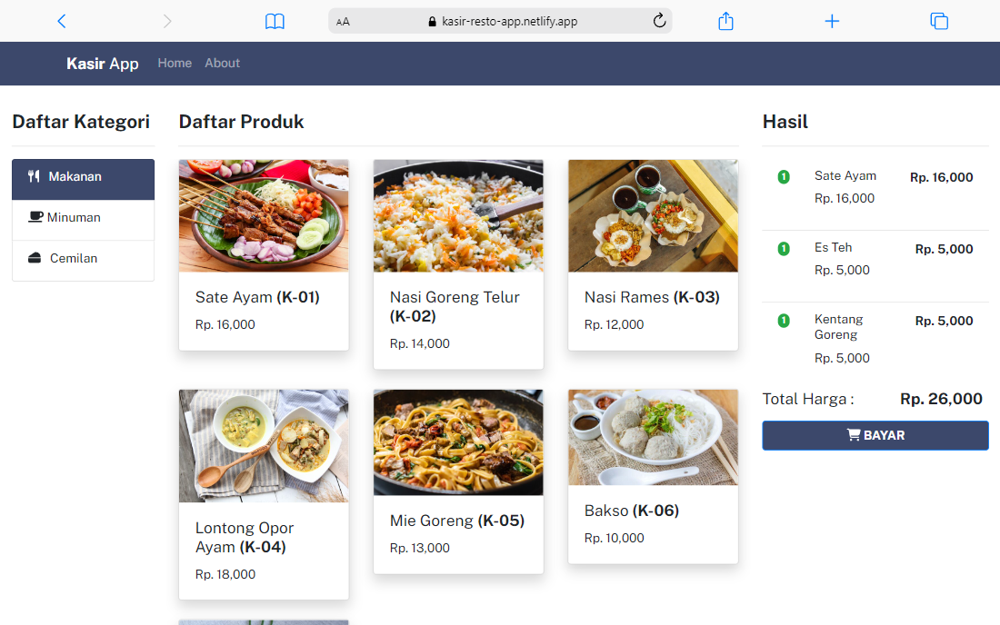

# Kasir App - Frontend

 

Aplikasi Kasir adalah aplikasi kasir online untuk melakukan daftar makanan, minuman atau makanan ringan yang dipesan pelanggan.

## Teknologi
- React Js
- Bootstrap

## SETUP DEPLOYMENT ENV

Cara menjalankan frontend:
- Masuk ke direktori frontend
- Jalankan perintah di bawah ini di terminal

`npm start`

